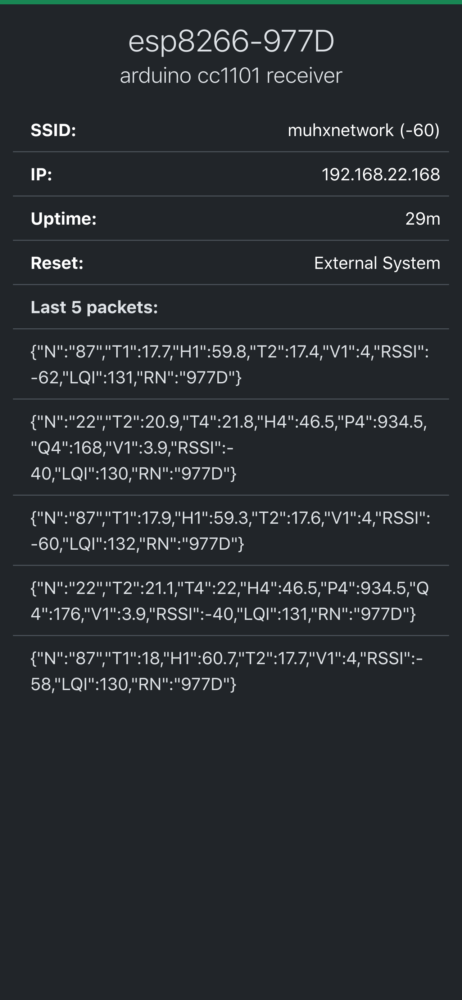

# arduino-cc1101-receiver

An Arduino CC1101 receiver for ESP8266/ESP32

<p align="center">

</p>

## Contents

 * [About](#about)
   * [Built With](#built-with)
 * [Getting Started](#getting-started)
   * [Prerequisites](#prerequisites)
   * [Installation](#installation)
 * [Usage](#usage)
 * [Roadmap](#roadmap)
 * [Release History](#release-history)
 * [License](#license)
 * [Contact](#contact)
 * [Acknowledgements](#acknowledgements)

## About

The arduino-cc1101-receiver receives a 61 characters string and adds RSSI/LQI.

```
Z:60,N:87,T1:29,H1:817,T2:25,T3:42,P1:9260,A1:753,V1:38

Z = package length
N = node id
I = package counter
T = temperature
H = humidity
P = pressure
A = altitude
Q = air quality
V = voltage
M = motion
S = switch

, = delimiter

X1 = si7021
X2 = ds18b20
X3 = bmp280
X4 = bme680

RSSI = Signal strength
LQI = Signal quality
RN = receiver node id
```

#### Features
- Websocket
- mDNS
- OTA Update

### Built With

* [VSCode](https://github.com/microsoft/vscode)
* [PlatformIO](https://platformio.org/)
* [SmartRC-CC1101-Driver-Lib](https://github.com/LSatan/SmartRC-CC1101-Driver-Lib/)

## Getting Started

### Prerequisites

* An Arduino/ESP8266/ESP32 with a CC1101 module as a receiver
   * Wiring diagram: [SmartRC-CC1101-Driver-Lib](https://github.com/LSatan/SmartRC-CC1101-Driver-Lib/)
* An Arduino with a CC1101 module as a transmitter [13/arduino-cc1101-transmitter](https://github.com/13/arduino-cc1101-transmitter)
   * Wiring diagram: [AskSin++](https://asksinpp.de/Grundlagen/01_hardware.html#stromversorgung)
* VSCode
* PlatformIO

### Installation

```sh
git clone https://github.com/13/arduino-cc1101-receiver.git
```

## Usage

* Edit `main.cpp` to your needs
* Edit `platformio.ini` to your needs
* Build & upload to your Arduino

## Roadmap

- [ ] ...

## Release History

* v10
    * Initial release

## Contact

* **13** - *Initial work* - [13](https://github.com/13)

## License

This project is licensed under the MIT License - see the [LICENSE.md](LICENSE.md) file for details

## Acknowledgments

* Thank you
